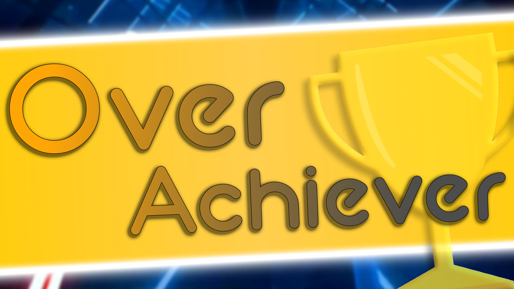

  

# OverAchiever

A Quest Mod that brings Beat Saber Achievements back into the game with some additional features

## Features: (W.I.P.)
- [ ] Achievement Alerts during a level
- [ ] Show completed achievements after finishing a level
- [ ] Bonus Achievements
- [ ] Achievement Packs (Experimental)

## Contributing

You can contribute to any of my mods. Fork and modify to your heart's content as long as it respects the license.

I will not accept any of the following "Contributions":

- Version bumps; I will update my mods myself to new versions of Beat Saber unless specifically stated - if I haven't updated the mod, it means I either do not support it or I am in process of rewriting the mod.
- README edits; Editing the readme file to fix a typo does not make you a contributor.

### Contributor(s)

Here are the person(s) that have contributed to this mod.

